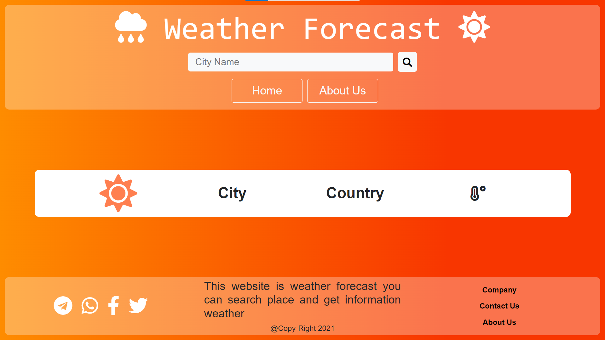
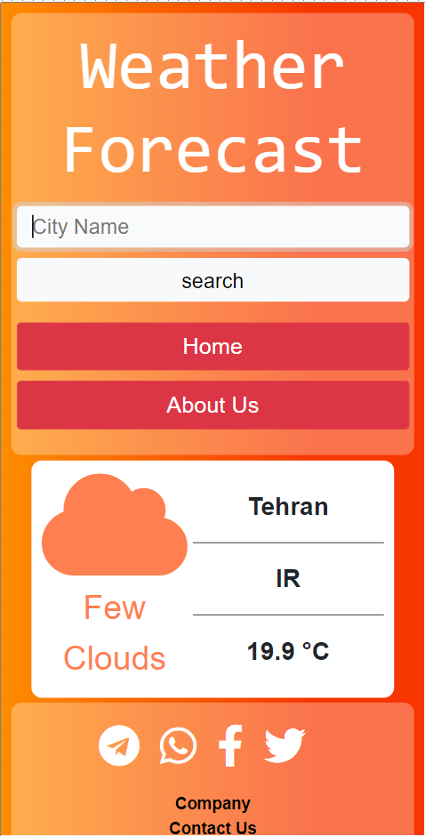

# Weather Forecast

<p dir='rtl' align='right'>
 شما با استفاده از این وب سایت می توایند منطقه مورد نظرتان را جستجو کرده از آب و هوای ان مطلع شود.  
</p>

## API OpenWeather

<p dir='rtl' align='right'>
این وب سایت از  api OpenWeather استفاده می کند تا اطلاعات مورد نیاز را دریافت کند و به شما نمایش دهد. 
</p>

#### Temperature

<p dir='rtl' align='right'>
این api پیش فرض  دما را بر حسب kelvin می دهد و برای گرفتن سلسیوس باید به این روش عمل کرد. 
</p>

``` Celsius = Kelvin - 273.15 ```

## images




